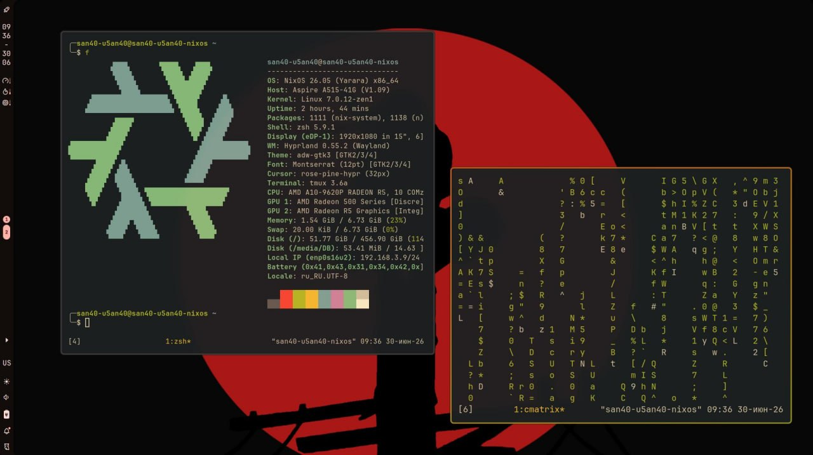

# DotFiles.NixOS

## Окружение рабочего стола
|Категория|Реализация|
|:-:|:-:|
|Менеджер окон|Hyprland|
|Панели|Noctalia|
|Экран блокировки|Hyprlock (автозапуск из Hyprland, подробнее в './nixos/system-modules/visual.nix' и './home-manager/desktop-environment/hyprland/configuration/events.lua')|
|Курсор|Rose-pine-hypr (32px)|
|Оформление|Stylix|
|Терминал|Alacritty -> Tmux -> Zsh|
|Офис|OnlyOffice|
|Браузер|LibreWolf|
|Редакторы кода|LSP Servers(nil, lua-ls, roslyn-ls) -> NeoVim / VSCode-fhs|
|Дополнительно|Discord и YouTube работают поверх Zapret, есть Steam, MySQL, Syncthing, Git, Flameshot и мн.др.|

